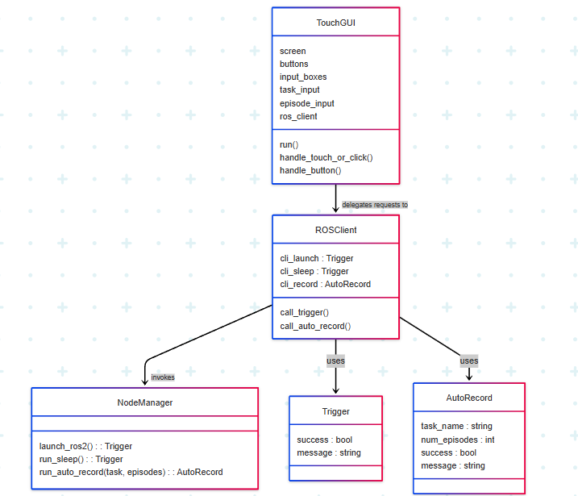
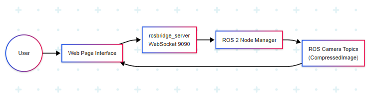

# ALOHA Control System

The ALOHA Control System is a modular, ROS 2-based software suite designed for robotic orchestration and task automation. It includes two frontend interfaces (a local touchscreen and a web-based GUI) and a backend ROS 2 service node called Node Manager.

---

## Project Structure

```
aloha-raspi-web-ui/
├── backend/
│   ├── node_manager.py
│   ├── README.md
│   └── Images/
│       ├── backend flow.png
│       └── Overall_Work_Flow_Architecture.png
├── frontend/
│   ├── raspi/
│   │   ├── ALOHA_GUI_TOUCH.py
│   │   └── Images/
│   │       ├── raspi flow.png
│   │       ├── FLOW.png
│   │       ├── ROS_GUI_TOUCH_UML.png
│   │       └── ALOHA_GUI_TOUCH_PANEL_VIEW.jpeg
│   ├── ui/
│   │   ├── Web_page (1).html
│   │   ├── README.md
│   │   └── Images/
│   │       ├── html class.png
│   │       ├── html uml.png
│   │       ├── html camera.png
│   │       └── html system contetx.png
├── README.md  <-- Main system overview
```

---

## System Overview

This system is composed of:

- **Backend Node Manager**: Manages ROS 2 bringup, task execution, and service coordination.
- **Frontend Interfaces**:
  - **Raspberry Pi GUI**: Touchscreen interface using `pygame`.
  - **Web Interface**: HTML + JS interface using `rosbridge_server`.

---

## Backend Architecture

The backend Node Manager handles service logic via ROS 2:

- `launch_ros2` to initialize bringup
- `run_sleep` to execute sleep mode
- `run_auto_record` to launch recording tasks with parameters

**Diagram**:  


---

## Raspberry Pi Frontend

- Designed for local physical interaction
- Built with `pygame` and `rclpy`
- Dynamically interacts with ROS services

**Diagram**:  


---

## Web Frontend

- Browser-based and network-accessible
- Built with HTML, ROSLIB.js, and TailwindCSS
- Displays camera feeds and buttons for all operations

**Class Structure**:  


**Camera Feed Flow**:  


**System Context**:  


---

## How to Run

From a ROS 2-sourced terminal:

```bash
ros2 run backend node_manager
```

Run Raspberry Pi GUI:

```bash
python3 frontend/raspi/ALOHA_GUI_TOUCH.py
```

Open the web interface:

```bash
firefox frontend/ui/Web_page\ \(1\).html
```

Make sure `rosbridge_websocket` is running for the web UI.

---

## Maintainer

U. Sai Jayaprakash  
Graduate School of Science and Engineering, Hosei University  
System Integration and Robotics Lab
