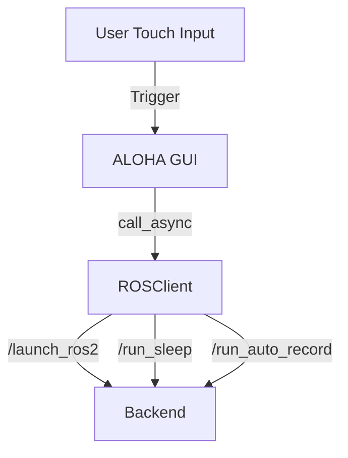
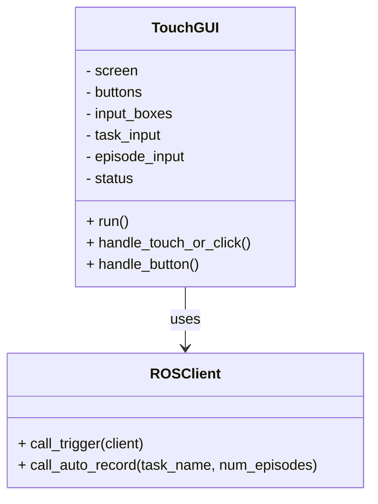

# ALOHA Raspberry Pi Touch Interface

A fullscreen, local touchscreen interface for Raspberry Pi, enabling real-time interaction with the ALOHA robot via ROS 2 service calls.

---

## System Overview



---

## Component Diagram



---

## File Location

```
frontend/
└── ALOHA_GUI_TOUCH.py
```

---


## Execution

```bash
python3 ALOHA_GUI_TOUCH.py
```

Preconditions:
- ROS 2 sourced
- Backend node_manager running

---

## Requirements

- pygame
- ROS 2 (rclpy, std_srvs, aloha_msgs)

---

## Author

Sai 
