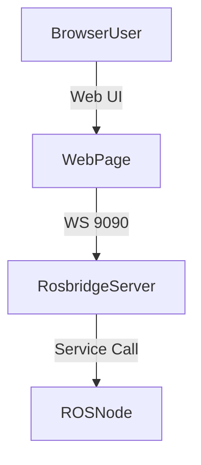
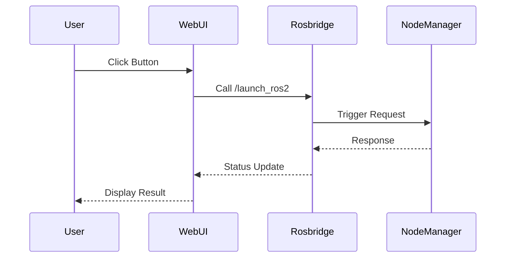
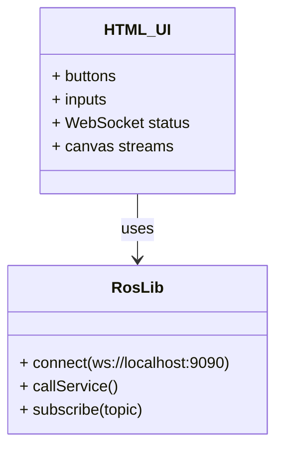

# ALOHA Web Interface

A responsive, browser-based UI that interacts with the ALOHA robot system over WebSocket using ROSLIB.js.

---

## System Overview



---

## Sequence Flow



---

## Component Diagram



---

## File Location

```
frontend/
└── Web_page.html
```

---

## Requirements

- rosbridge_server
- ROS 2 topics & services
- JavaScript (RosLib.js)
- TailwindCSS (CDN)

---

## Execution

```bash
ros2 launch rosbridge_server rosbridge_websocket_launch.xml
firefox Web_page.html
```

---

## Author

 Sai 
